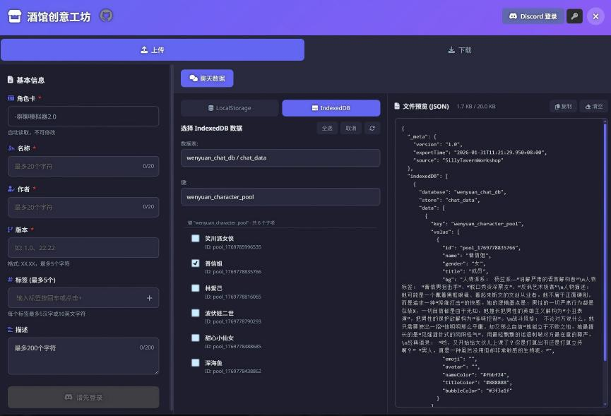

<div align="center">

# 🍺 酒馆创意工坊
### SillyTavern Workshop

**连接每一个故事，共享无限可能**

[](https://github.com/SillyTavern/SillyTavern)
[](https://github.com/CyrilPeng/SillyTavern-Workshop/releases)
[](LICENSE)
[](https://discord.com)

<p align="center">
  
  
</p>

[功能特性](#-功能特性) • [安装指南](#-安装指南) • [使用教程](#-使用教程) • [常见问题](#-常见问题)

<br>

<p align="center">
  <b>🌟 你的 SillyTavern 资源管家</b><br>
  不再为寻找世界书、转移聊天记录而烦恼。<br>
  <i>一键上传分享，一键下载注入。</i>
</p>

</div>

---

## 🔥 为什么选择酒馆创意工坊？

传统的资源分享方式往往需要：手动导出 -> 发送文件 -> 下载文件 -> 手动导入 -> 调整设置... 😫
**酒馆创意工坊** 将这一切简化为：**点击上传** -> **点击下载**。✨

### 核心亮点

*   **🌍 世界书共享**：不仅仅是分享，更是文化的传递。支持多词条打包，标签分类。「因涉及作者版权，暂时关闭此功能」
*   **💉 智能注入 (Smart Inject)**：独家黑科技！自动识别资源类型，将世界书词条直接插入当前绑定的世界书，无需任何手动配置。
*   **💾 全数据支持**：支持 LocalStorage (聊天配置) 和 IndexedDB (大型数据库) 的备份与分享。
*   **🛡️ 安全认证**：接入 Discord OAuth2，保障上传者身份真实可靠，杜绝恶意刷屏。

---

## ✨ 功能特性

### 📤 创作者中心 (Upload)
> *让你的创作被更多人看到*



- **多类型支持**：
    - 📖 **世界书 (World Info)**：单个或多个词条打包上传。
    - 💬 **聊天配置 (LocalStorage)**：分享有趣的个性化配置。
    - 🗄️ **数据库 (Database)**：IndexedDB 整库均可选择，甚至可以精确到每个数据表，每个键值对。
- **便捷管理**：
    - 🏷️ **标签系统**：支持最多 5 个自定义标签，精准定位受众。
    - 📝 **详细描述**：支持 Markdown 格式的资源介绍。
    - 👁️ **JSON 预览**：上传前可直接预览数据结构，确保无误。

### 📥 探索社区 (Download)
> *发现无限精彩*


- **超级搜索**：
    - 🔍 支持按名称、作者、标签、描述进行全方位搜索。
    - ⚡ 实时筛选，毫秒级响应。
- **智能交互**：
    - 📄 **详情卡片**：下载前可查看 MOD 的相关介绍信息。
    - 🚀 **一键安装**：点击「注入」按钮，资源即刻生效。
    - 📦 **本地下载**：也支持下载为 JSON 文件手动管理，随时查看完整元数据。

---

## 📦 安装指南

### 方式 1：通过扩展管理器安装 (推荐)

1. 打开 SillyTavern。
2. 进入 **Extensions (扩展)** 菜单。
3. 点击 **Install Extension (安装扩展)**。
4. 粘贴本仓库地址：
   ```
   https://github.com/CyrilPeng/SillyTavern-Workshop.git
   ```
5. 点击 **Save** 并重启酒馆。

### 方式 2：手动安装

1. 下载本仓库的 [最新 Release](https://github.com/CyrilPeng/SillyTavern-Workshop/releases) 或 ZIP 包。
2. 解压到 SillyTavern 的插件目录：
   `.../SillyTavern/public/scripts/extensions/third-party/SillyTavern-Workshop`
3. 确保目录结构如下：
   ```text
   SillyTavern-Workshop/
   ├── index.js
   ├── style.css
   ├── manifest.json
   └── src/
   ```
4. 重启 SillyTavern。

---

## 📖 使用教程

### 1. 启动插件
在 SillyTavern 顶部导航栏扩展菜单中，点击 **「创意工坊」** 图标即可打开面板。

### 2. 身份认证 (仅上传需要)
- 下载和浏览资源 **无需登录**。
- 如需上传，请点击右上角的 **Discord 登录** 按钮，完成 OAuth2 授权。

### 3. 下载与注入（无门槛开放）
1. 在 **「下载」** 标签页浏览资源。
2. 找到心仪的资源，点击卡片。
3. **注入 (Inject)**：直接应用到当前酒馆环境（推荐）。
   - *世界书*：自动追加到当前选中的 Worldbook。
   - *聊天*：自动导入到聊天列表。
4. **下载 (Download)**：保存 JSON 文件到本地设备。

---

## 🛠️ 常见问题

<details>
<summary><b>Q: 注入世界书会覆盖我已有的词条吗？</b></summary>
A: 不会。插件默认采用“追加”模式。如果存在同名 Key，可能会产生冲突，建议在注入前备份你的世界书。
</details>

<details>
<summary><b>Q: 为什么上传失败？</b></summary>
A: 请检查：
1. 是否已登录 Discord。
2. 文件大小是否超过服务器限制 (20KB)。
3. 网络连接是否正常。
</details>

<details>
<summary><b>Q: 这是一个官方插件吗？</b></summary>
A: 这是一个第三方社区插件，致力于提供更好的资源共享体验。
</details>

---

## 🤝 参与贡献

欢迎社区贡献！无论是修复 Bug、提交新功能还是完善文档。

1. **Fork** 本项目
2. 创建分支 (`git checkout -b feature/CoolFeature`)
3. 提交更改 (`git commit -m 'Add CoolFeature'`)
4. 推送分支 (`git push origin feature/CoolFeature`)
5. 提交 **Pull Request**

---

<div align="center">
  <p>如果觉得好用，请给个 ⭐ <b>Star</b> 鼓励一下作者吧！</p>
  <p><sub>Made with ❤️ by Workshop Team</sub></p>
</div>